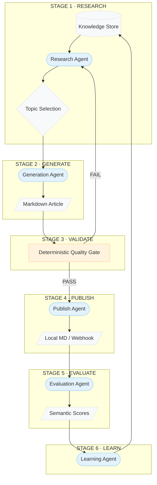

# 📝 SEO-Content-Engine: The Autonomous Self-Improving SEO Loop

> *How deterministic quality gates, multi-stage agentic orchestration, and a persistent knowledge store combine into a fully autonomous SEO engine — built for production stability.*

**By Dr. Yasser Mustafa**  
*Lead Data Scientist · PhD Theoretical Physics · Open-Source Author*  
[GitHub](https://github.com/Yasser03) | [Medium](https://medium.com/@yasser.mustafa) | yasser.mustafan@gmail.com | [LinkedIn](https://www.linkedin.com/in/yasser-mustafa-ai/)  

---

### 🚀 [Try the Live Dashboard Now!](https://seo-content-engine.streamlit.app/)

The engine is deployed and ready for immediate testing. No installation required.

---

## 01 Understanding the Problem
SEO content generation is a domain plagued by a "quality vs. quantity" paradox. Traditional automated tools often prioritize volume, resulting in generic, keyword-stuffed "fluff" that search engines increasingly penalize. Conversely, manual high-quality content generation is slow and expensive to scale.

The **SEO-Content-Engine** is designed to break this paradox. It is not just a wrapper for a large language model (LLM); it is an **autonomous orchestration system** that manages the entire content lifecycle: from identifying keyword gaps to enforcing deterministic quality standards and learning from past iterations.

The challenge is three-fold:
1.  **Contextual Awareness**: Ensuring the engine doesn't repeat itself or miss fresh angles in a niche.
2.  **Deterministic Quality**: Ensuring that the "creative" LLM output is strictly validated against hard business requirements (word count, structure, keyword density).
3.  **The Feedback Loop**: Creating a system that actually gets better at writing for a specific client over time by analyzing its own successful and failed generations.

---

## 02 System Architecture
The engine is structured as a six-stage pipeline. Unlike a single-prompt generation, this multi-stage approach allows for independent verification and intervention at every step of the lifecycle.


*Fig. 1 — The closed-loop architecture of the SEO-Content-Engine.*

---

## 03 The Research & Knowledge Layer
The core differentiator of this system is the **Knowledge Store**. Rather than operating in a stateless vacuum, the engine maintains a flat-file JSON database (`store/knowledge.json`) that tracks:
- **Keyword History**: Ensuring 100% uniqueness in primary keyword selection.
- **Preferred Angles**: Identifying which narrative styles (e.g., "practical guide" vs "thought leadership") have historically passed evaluation.
- **Structural Success**: Storing the headers and layouts of high-scoring articles to use as few-shot examples for future generations.

The **Research Agent** queries this store to identify "opportunity gaps"—topics the engine hasn't covered yet but which align with the client's seed keywords and domain niche.

---

## 04 The Generation & Quality Gate
The **Generation Agent** produces the content, but it is the **Quality Gate** that ensures it is production-ready.

### Deterministic vs. AI-Based Validation
A common mistake in AI systems is using an LLM to evaluate another LLM's output. While useful for semantic scoring (see Stage 5), it is unreliable for hard constraints. The SEO-Content-Engine uses **deterministic Python logic** for its primary gate:
- **Word Count**: Reached the minimum threshold?
- **Structure**: Does it have an Intro, at least 3 H2s, and a Conclusion?
- **Keyword Density**: Is the primary keyword naturally integrated (0.5% - 1.5%) or is it "stuffed"?
- **Internal Linking**: Are link candidates from the knowledge store utilized correctly?

> **Design Principle:** If an article fails the deterministic gate, it is aborted immediately. We do not waste tokens (or time) evaluating content that hasn't met the baseline structural requirements.

---

## 05 Step-by-Step: Running the Engine

### Prerequisites
This project uses **[uv](https://github.com/astral-sh/uv)** for high-performance dependency management. Ensure you have it installed:
```powershell
powershell -c "irm https://astral.sh/uv/install.ps1 | iex"
```

### 1. Setup & Configuration
Clone the repository and initialize the environment:
```bash
git clone https://github.com/Yasser03/SEO-Content-Engine
cd SEO-Content-Engine
uv sync
```

Configure your API keys in a `.env` file:
```bash
echo "GROQ_API_KEY=your_key_here" > .env
```

Customize the engine for your niche in `config/client.yaml`:
```yaml
client:
  name: "Tech Founders Hub"
  domain: "techfounders.io"
topic:
  seed_keywords: ["SaaS automation", "AI productivity"]
  domain_niche: "AI tools for startup operators"
```

### 2. Launching the Premium Dashboard
The Streamlit app provides a real-time visualization of the loop.
```bash
uv run streamlit run streamlit_app.py
```
- **Run Loop Tab**: Manually trigger content generation cycles.
- **Dashboard Tab**: View high-level metrics (Avg Quality, Topics Covered).
- **Analytics Tab**: Deep dive into score trends and keyword utilization.

### 3. Headless Execution (CLI)
For scheduled or autonomous background runs:
```bash
uv run python pipeline.py --loops 5
```

---

## 06 Reflections and The Learning Loop
The final stage, **Learn**, is where the "intelligence" of the system resides. After an article is published, the **Evaluation Agent** scores it across dimensions like *Semantic Coverage*, *Readability*, and *SEO Alignment*.

The **Learning Agent** then distill these results. If an article scored exceptionally high, its H2 structure and the "angle" used are extracted and stored as "High-Performing Patterns." Future research phases will prioritize these patterns, creating a self-reinforcing cycle of quality improvement.

---

## 📄 Detailed Technical Article
For an in-depth exploration of the architecture, design principles, and engineering decisions behind this project, please download and view the [Detailed Technical Article](./SEO_Content_Engine_Article.html).

## ⚖️ Engineering Judgment & Reflections
For an honest assessment of the system's limitations, quality gate risks, and architectural trade-offs, see the [JUDGEMENT.md](./JUDGEMENT.md) file. This document covers:
- What would break the quality gate (False Negatives).
- Specifics of what the learning layer knows after each loop.
- Scalability risks for multi-client deployment.
- Technical cuts made for the initial release.

---

## 🛠️ Technical Stack
- **Core Orchestration**: Python 3.11+
- **Dependency Management**: [uv](https://github.com/astral-sh/uv)
- **LLM Backbone**: Groq (Llama-3.3-70B) / OpenAI / Anthropic
- **Interface**: Streamlit with Custom CSS (Glassmorphism)
- **Data Persistence**: Lightweight JSON Knowledge Store
- **Testing**: Pytest (Deterministic Logic Verification)

---

*© 2026 Dr. Yasser Mustafa — AI & Data Science Specialist | Newcastle upon Tyne, UK*
